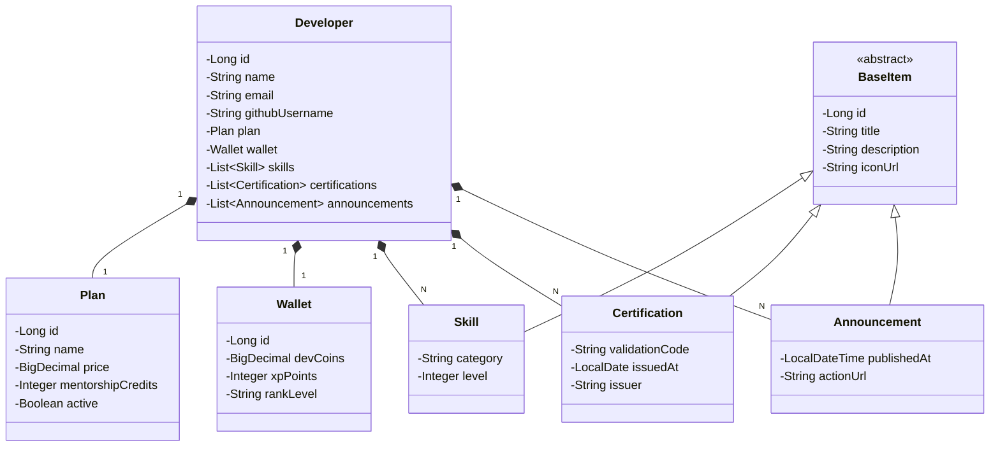

# DevAcademy REST API

<p align="center">
  
  
  
  
  
</p>

> **Desafio DIO**: Publicando sua API REST na Nuvem Usando Spring Boot 3, Java 17 e Railway.
> 
> *Versão de Novo Domínio + Evolução Avançada*: Uma plataforma RESTful moderna para gerenciamento de perfis de desenvolvedores, planos de mentoria, carteira de XP/moedas (DevCoins), catálogo de habilidades técnicas (*skills*), certificações e comunicados.

---

## 📌 Sumário
- [Sobre o Projeto](#-sobre-o-projeto)
- [Tecnologias Utilizadas](#-tecnologias-utilizadas)
- [Arquitetura e Diagrama de Classes](#-arquitetura-e-diagrama-de-classes)
- [Tratamento Global de Exceções & Validações](#-tratamento-global-de-exceções--validações)
- [Documentação OpenAPI / Swagger](#-documentação-openapi--swagger)
- [Endpoints da API](#-endpoints-da-api)
- [Perfis de Execução (Profiles)](#-perfis-de-execução-profiles)
- [Como Executar Localmente](#-como-executar-localmente)
- [Guia de Deploy na Nuvem (Railway)](#-guia-de-deploy-na-nuvem-railway)

---

## 💡 Sobre o Projeto

Este projeto foi desenvolvido como uma solução de **nível avançado com novo domínio de negócio** para o desafio de projeto da **Digital Innovation One (DIO)**.

Em substituição ao domínio bancário convencional do laboratório original (`User`, `Account`, `Card`), criamos o **DevAcademy**, ecossistema voltado para acelerar o desenvolvimento de carreira de profissionais tech.

### Diferenciais da Solução:
- **Composição e Herança Limpa**: Uso de `@MappedSuperclass` com classe abstrata `BaseItem` para reuso consistente de campos.
- **Validação Declarativa Robusta**: Anotações Jakarta Bean Validation (`@NotBlank`, `@Email`, `@PositiveOrZero`, `@Min`, `@Max`, `@Valid`).
- **Tratamento Global de Erros**: Respostas de erro padronizadas (`StandardError` e `ValidationError`) capturadas via `@RestControllerAdvice`.
- **Suporte a Paginação e Ordenação**: Endpoint dedicado `/api/v1/developers/paged` integrado ao Spring Data `Pageable`.
- **Compatibilidade Multi-banco**: H2 Database em memória para desenvolvimento e testes rápidos; PostgreSQL pronto para produção.

---

## 🚀 Tecnologias Utilizadas

| Tecnologia | Versão | Descrição |
| :--- | :--- | :--- |
| **Java** | 17 LTS / 21 LTS | Linguagem base da aplicação |
| **Spring Boot** | 3.2.3 | Framework de autoconfiguração e produtividade |
| **Spring Data JPA** | 3.2.3 | Camada de persistência e repositórios |
| **Jakarta Validation** | 3.0 | Validação de payloads e regras de entrada |
| **H2 Database** | 2.2 | Banco de dados relacional em memória (Dev/Test) |
| **PostgreSQL** | 42.6 | Driver de banco de dados para produção na nuvem |
| **Springdoc OpenAPI** | 2.3.0 | Geração automática de documentação e Swagger UI |
| **Lombok** | 1.18 | Redução de código boilerplate (getters, setters, constructors) |
| **Railway** | Cloud | Plataforma PaaS para hospedagem da API e banco de dados |

---

## 🏛 Arquitetura e Diagrama de Classes



---

## 🛡 Tratamento Global de Exceções & Validações

A API implementa um interceptor global de exceções via `@RestControllerAdvice` (`GlobalExceptionHandler`), fornecendo respostas claras nos seguintes cenários:

- **404 Not Found** (`ResourceNotFoundException`): Quando o ID informado não existir.
- **422 Unprocessable Entity** (`BusinessException`): Quando regras de negócio forem violadas (ex: e-mail ou GitHub já cadastrados).
- **400 Bad Request** (`ValidationError`): Quando campos obrigatórios forem omitidos ou inválidos, retornando a lista `errors: [{ fieldName, message }]`.
- **500 Internal Server Error**: Captura de exceções genéricas não tratadas.

---

## 📖 Documentação OpenAPI / Swagger

Ao rodar a aplicação localmente, a documentação interativa Swagger pode ser acessada em:
👉 **[http://localhost:8080/swagger-ui.html](http://localhost:8080/swagger-ui.html)**

JSON de especificação OpenAPI 3.0:
👉 **[http://localhost:8080/v3/api-docs](http://localhost:8080/v3/api-docs)**

---

## 📡 Endpoints da API

### Desenvolvedores (`/api/v1/developers`)

| Método | Endpoint | Descrição | Status Sucesso |
| :--- | :--- | :--- | :--- |
| `GET` | `/api/v1/developers` | Lista todos os desenvolvedores cadastrados | `200 OK` |
| `GET` | `/api/v1/developers/paged` | Lista desenvolvedores com paginação (`?page=0&size=10&sort=name,asc`) | `200 OK` |
| `GET` | `/api/v1/developers/{id}` | Retorna um desenvolvedor específico pelo ID | `200 OK` |
| `POST` | `/api/v1/developers` | Cadastra um novo desenvolvedor com dados agregados | `201 Created` |
| `PUT` | `/api/v1/developers/{id}` | Atualiza todos os dados de um desenvolvedor | `200 OK` |
| `DELETE` | `/api/v1/developers/{id}` | Remove um desenvolvedor do sistema | `204 No Content` |

### Exemplo de Payload JSON para Criação (`POST /api/v1/developers`):

```json
{
  "name": "Sarah Tambalo",
  "email": "sarah.tambalo@example.com",
  "githubUsername": "sarahtambalo",
  "plan": {
    "name": "Pro Developer",
    "price": 59.90,
    "mentorshipCredits": 4,
    "active": true
  },
  "wallet": {
    "devCoins": 250.00,
    "xpPoints": 3400,
    "rankLevel": "PLENO"
  },
  "skills": [
    {
      "title": "Spring Boot 3",
      "description": "Desenvolvimento de APIs RESTful e Microsserviços com Java",
      "iconUrl": "https://raw.githubusercontent.com/tandpfun/skill-icons/main/icons/Spring-Light.svg",
      "category": "Backend",
      "level": 4
    },
    {
      "title": "Docker & Containers",
      "description": "Containerização e orquestração de aplicações",
      "iconUrl": "https://raw.githubusercontent.com/tandpfun/skill-icons/main/icons/Docker.svg",
      "category": "DevOps",
      "level": 3
    }
  ],
  "certifications": [
    {
      "title": "Bootcamp Backend Java",
      "description": "Certificado de conclusão de 75h em Java, Spring Framework e Nuvem",
      "iconUrl": "https://hermes.digitalinnovation.one/assets/diome/logo-minimized.png",
      "validationCode": "DIO-JAVA-2023-XYZ",
      "issuedAt": "2023-10-15",
      "issuer": "Digital Innovation One"
    }
  ],
  "announcements": [
    {
      "title": "Novo Desafio de Microsserviços Liberado!",
      "description": "Participe do hackathon e acumule até 500 DevCoins adicionais.",
      "iconUrl": "https://img.icons8.com/color/48/trophy.png",
      "publishedAt": "2026-08-26T10:00:00",
      "actionUrl": "https://dio.me/hackathons"
    }
  ]
}
```

---

## ⚙ Perfis de Execução (Profiles)

1. **`dev`** (*Padrão*):
   - Banco de dados em memória **H2** (`jdbc:h2:mem:devacademydb`).
   - Console web H2 habilitado em `http://localhost:8080/h2-console` (JDBC URL: `jdbc:h2:mem:devacademydb`, Usuário: `sa`, Senha em branco).
   - `hibernate.ddl-auto: create-drop`

2. **`prd`** (*Produção / Nuvem*):
   - Conexão configurada para **PostgreSQL** via variáveis de ambiente (`DATABASE_URL`, `PGUSER`, `PGPASSWORD`, `PORT`).
   - `hibernate.ddl-auto: update`

---

## 💻 Como Executar Localmente

### Pré-requisitos
- **Java 17** ou superior instalado (`java -version`).
- O projeto inclui o **Maven Wrapper (`mvnw` / `mvnw.cmd`)**, portanto **não** é necessário ter o Maven instalado globalmente.

### Passos:
1. Clone o repositório ou acesse a pasta do projeto:
   ```bash
   cd devacademy-api
   ```

2. Execute a suíte de testes:
   - **Linux / macOS**: `./mvnw test`
   - **Windows**: `.\mvnw.cmd test`

3. Inicie a aplicação no perfil de desenvolvimento:
   - **Linux / macOS**: `./mvnw spring-boot:run`
   - **Windows**: `.\mvnw.cmd spring-boot:run`

4. Acesse:
   - Swagger UI: `http://localhost:8080/swagger-ui.html`
   - Console H2: `http://localhost:8080/h2-console`

---
